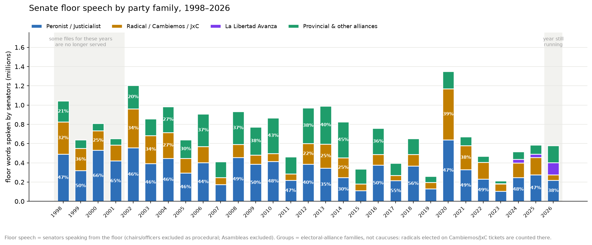
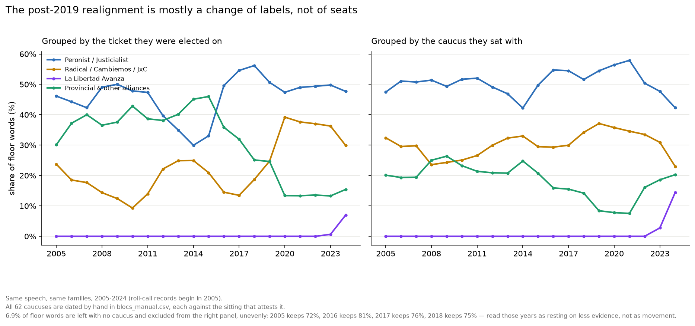
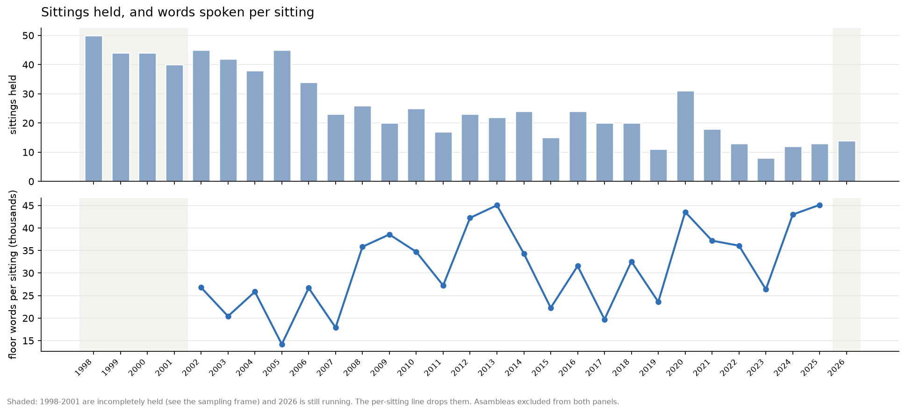
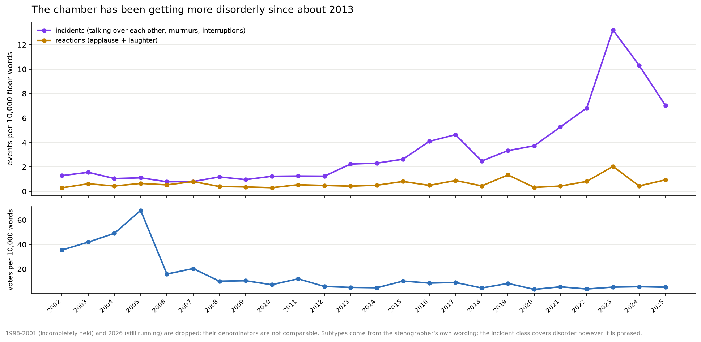

# ar_congress

Corpus of Argentine Senate stenographic session transcripts ("versiones
taquigráficas"): acquisition, parsing into structured speaker-attributed
text blocks, and analysis. The chamber serves them as PDFs from 2004 on and
as its own HTML export for most of 1998–2003; both are read here.

## Status (September 2026)

- 819 session transcript files held, spanning 1998–2026, which are 818 distinct
  sittings: one of them the portal serves twice, under two reunión numbers.
  Coverage is complete from
  2002 onward — every session the portal lists for those years is held — and
  partial before it: 51 of 73 for 1998, 47 of 74 for 1999, 46 of 75 for 2000,
  44 of 83 for 2001. 1997 contributes a single sitting, an impeachment tribunal
  of 18 December. The portal lists sittings back to 1983, but of the 882 it
  lists before 1998 exactly one is still served; the other 881 answer 404. That
  was established by asking for all 882, not by sampling, so 1998 is the floor
  and there is no point looking again.
- **Two formats, one corpus.** The portal serves the same URL as a PDF for the
  sittings from 2004 on and as the chamber's own HTML export for most of
  1998–2003 (212 of the 214 held come from Corel WordPerfect). The downloader
  used to reject anything that did not begin with `%PDF`, which is why those
  years looked unserved: 211 sittings were being thrown away as they arrived.
  Both formats are kept as served, and every row carries the `source_format`
  it came from.
- **What the record declares about itself.** A sitting's masthead may read
  "VERSIÓN TAQUIGRÁFICA (PROVISIONAL)" — the uncorrected record — and the
  manifest carries that as `provisional`, with three values rather than two:
  309 sittings say they are provisional, 338 say they are not, and 172 make no
  claim, because from 2018 the words leave the masthead altogether. Calling
  that last group final would invent a fact about 134 sittings. Read it from
  the raw file: the parser drops the masthead as page apparatus, so parsed text
  puts every PDF at "not provisional" when 261 of 605 are.
- Corpus parsed: 245,683 speaker-attributed speech blocks and 69,350 typed
  stenographer events in 439,735 rows over 817 sittings, as per-session Parquet
  under `data/processed/senado/`. 25.7 million words of attributed speech, of
  which the HTML side contributes 5.9 million. The PDF side is parser 0.5.3 and
  the HTML side `scripts/parse_html.py` at 0.5.8-html; the two share the speaker
  pattern and the event subtypes, so a passage means the same thing in either.
  One sitting fails to parse: the 1997 impeachment tribunal, a photocopy saved
  as page images with no text layer at all, so there is nothing to read. It used to be two — the no-quorum sitting of 29
  November 2001 joined the corpus in 0.4.38, when the front-matter cut learned
  to recognise an opening whose dash the file had set in roman with the page
  number before it. Text that
  cannot be attributed to a speaker is 1.25% of the corpus, and in the HTML era
  83% of those words stand inside a run of inserted matter — speeches handed in
  for the record and never delivered, and the bills read into it.
- **The portal serves one sitting twice, and the document says which one it
  is.** 29 October 2003 is listed as reunión 27 and as reunión 28, and both
  URLs return byte-identical files. The document's own masthead reads "28°
  Reunión - 6° Sesión en tribunal", so reunión 28 is what it is and reunión 27's
  slot returns the wrong document; the corpus parses it once, under reunión 28,
  and `reference/senado/superseded_sources.csv` records the decision. Both
  files stay on disk and in the manifest: what the portal serves is a fact
  about the portal. Whatever was said at the ordinary sitting of that day, the
  portal does not hold it.
- **The words no longer run together.** The 2003–2009 files end a line without
  storing a space, so the last word of one line used to come out glued to the
  first of the next — "reemplazala expresión". Parser 0.4.11 puts the space
  back wherever the page shows one, using a width measured off the files that
  do print their spaces: 670,660 spaces restored in 482 of the 559 sittings,
  and the corpus rises from 21.07 to 21.48 million words (+2.0% overall, +4%
  to +6.5% in every year from 2003 to 2009, under 0.1% elsewhere). Every word
  count in the analysis was that much low. It also makes those years' section
  numbering readable for the first time: the sittings carrying the section each
  turn belongs to went from 443 to 530, and stand at 538 today.
- **Punctuation belonging to the editorial matter no longer counts as speech.**
  A stenographer's note is printed "— Se vota.", but in many files that opening
  dash is stored at the end of the line above, so the turn before it came out
  ending on a dangling dash. It happened to 9,025 of the 26,937 notes that open
  with a dash — one in three. The mirror case is
  a note ending in a colon that opened the next turn instead (29). And where a
  section's number is set in the body face rather than the bold of its title,
  the number stayed on the turn above and the section was lost altogether —
  26 sections recovered. All three were found by readers of the sixth blind
  round and fixed in 0.4.13. The eighth round found the same fault splitting a
  word: an interjected note is set in italics, and in a few files the italic run
  carries a character or two past the closing parenthesis, so the note came out
  "(aplausos), s" and the sentence resumed at "i la Argentina debe ser tomada en
  su totalidad?". 0.4.14 gives those tails back — 5 broken words and 70 marks of
  sentence punctuation, in 75 turns.
- **Names are no longer cut in half.** The same change of face happens inside a
  speaker's own name: the page prints "Sr. Presidente. – Se gira…" but the last
  "e" of "Presidente" is set in roman rather than bold, so the corpus recorded a
  speaker called "Sr. President" and the turn began "e. – Se gira…" — also
  "Sra. Higone" for Higonet and "Sr. God" for Godoy. Two further faults came out
  with it. The terminator that closes a label is written ".-" with a plain
  hyphen from about 2013 on, which the parser's pattern did not accept, so the
  repair that already existed for this had been inert for a decade of sittings.
  And a sentence whose opening letters are set a point larger than the rest was
  dropped as page apparatus: the "T" of "Tiene la palabra…", and in one sitting
  the chair's whole "Por favor, les pido si podemos mantener el s—", leaving the
  turn to begin "ilencio durante la exposición". 0.4.16 repairs all three: 14
  names rejoined, 165 labels split from the speech stuck to them (69 more than
  the dash alone allowed), 82 words made whole again. Found by a new check that
  asks of all 152,549 speech blocks whether each begins and ends the way speech
  does — turns opening mid-word under a new speaker fall from 44 to 5, and those
  5 are printed that way.
- **A note is no longer put in somebody's mouth.** The page prints "— Se practica
  la votación por medios electrónicos."; the block ended after "la" and the rest
  was filed as speech, so the corpus had the chair saying "votación por medios
  electrónicos" out loud, and elsewhere "nacional en el mástil del recinto." —
  the tail of a note describing a senator raising the flag. 0.4.17 takes a tail
  of any length back to its note where the note ends on a letter and the tail
  opens in lower case: 8 of them, against 28,308 complete notes left untouched.
  0.4.18 does the same for an italic run that opens a turn — a newspaper's name
  printed right after the label was being swallowed by the turn above, putting
  one senator's words in another's mouth. Measured across the corpus: 2 cases.
- **Punctuation is no longer left standing on its own.** A word set in italics
  inside a sentence — a foreign word, a newspaper's name, a Latin phrase —
  arrives from the file as a piece of its own, and the comma or full stop that
  closes it is back in the body face, so it arrives as another piece again. Every
  piece was being joined with a space, so the corpus read "del  default . Por ese
  motivo" where the page reads "del default. Por ese motivo". 0.4.19 joins each
  piece the way the page sets it. Of the 4,653 marks that stood apart from their
  word, **3,618 were the parser's own doing and are now joined**; the 1,035 that
  remain are spaces the page itself prints. 0.4.20 extends the same rule to the
  marks the first pass left out — the closing quotation mark, the apostrophe, the
  square bracket — and to the opening side, where a quoted word had come out
  spaced on both sides: `caso " strawberry ",` for a page that prints
  `caso "strawberry",`. Together they stop 3,785 marks of punctuation being
  counted as words by anything that splits on spaces. Found by the ninth blind
  read, and completed by the review of that fix.
- **The characters no font would declare are readable now.** 1,234 characters of
  the corpus sat in the range Unicode reserves for private use, where a glyph
  lands when the file draws it from a font whose encoding it never states. The
  WordPerfect-era sittings draw ordinary typography from Symbol, SymbolMT,
  WordPerfect's MathA and Phonetic, and one sitting from a private slot of Times
  New Roman, so the ordinal of "5° Reunión", the dash after a speaker's label,
  the bullet of a printed list and even the "P" and the "g" of a running head all
  came out as codepoints meaning nothing, sitting inside words and sentences.
  0.4.22 gives thirteen of the fourteen the character its own page shows, read
  off the printed page rather than from the font's nominal table — these files
  print an ordinal with a nominally Greek codepoint. The fourteenth is removed
  instead of translated: it prints an upside-down A in the middle of the word
  "categoría", once, and keeping it would break the word for every reader. Where
  the page shows something the document plainly did not mean, the page still
  wins: one codepoint draws an underscore in two sittings that wanted an ordinal
  in one and an exclamation mark in the other, and it is recorded as the
  underscore it prints. A scan of all 559 source PDFs finds exactly these
  fourteen and no others, so **no private-use character is left in the corpus.**
  Giving the label dash back also lets repairs that were keyed on it see labels
  they had been blind to. The whole of the change is 13 places in two sittings:
  15 lines of page matter the parser
  could not read before — a dateline, a page number — are now recognised and
  dropped, and in ten of those places the dropped line had been splitting a
  senator's turn, so 22 half-turns rejoin into 10. That is 27 rows and 12 speech
  blocks fewer, with the same speaker, the same turn number and the same words on
  both sides of every one of the 13. Nothing else in the corpus moves: 48 other
  sittings have single characters translated inside ordinary speech, which is the
  point of the table, and no sitting anywhere changes a block, a turn number or a
  speaker.
- **A word whose letters are spaced apart is one word again.** A page that spaces
  out a word's letters to draw the eye to it — "T e n e r  c a l i d a d" in the
  President's address of 1 March 2009, "V o t a c i ó n  N o m i n a l" over every
  roll-call table from 2004 on — leaves a gap between every pair of letters as
  wide as the gap that means a missing space, so the corpus held one word per
  letter: 189 such runs in 50 sittings, 13 of them inside speech, and the phrases
  findable by no search. What tells the two apart is that a missing space is one
  wide gap between letters otherwise set tight, while a spaced-out word is a row
  of gaps that all measure alike. 0.4.24 puts no space inside such a row, and
  still puts one where the row is broken by a gap wider than the rest, which is
  where the page separates two words. The change is 115 blocks in 43 sittings —
  97 headings, 9 passages of speech, 9 of page matter — and **in all 115 the
  letters are identical and only the spacing moved**
  ([reference/verification/letter_spacing_0424.csv](reference/verification/letter_spacing_0424.csv)).
  With its heading legible, the masthead of a roll-call table is recognised in
  three sittings where it used to be lost, which is 15 new rows. Every output
  check of the audit is identical, and the gold set scores exactly as before.
  One line needed more than that, and 0.4.26 gave it: a roll-call masthead of 18
  November 2009 is set in a Tahoma whose declared widths belong, for half its
  letters, to the letter beside them, so an evenly spaced line arrives with half
  its gaps measuring nothing and half measuring the spacing, and the row of alike
  gaps breaks into pieces of two and three. A line is now taken as spaced from
  end to end when most of what can be measured says so and the line stores its
  own spaces — which is what makes it safe, since the word boundaries are then
  the file's own. It changes 3 blocks in 2 sittings, both page matter. One last
  heading, of 4 March 2009, still read "V otación Nominal", because the rule that
  keeps the space in front of a spaced-out word had no exception for a page that
  had already stored that space and so put a second one in, one letter inside the
  word; 0.4.27 applies that rule only where nothing is stored at that edge, which
  changes that single block and nothing else in the corpus. Four rows of lone
  letters are left, all a senator's own enumeration, spoken that way and
  correct as printed. Two more looked the same and were not: both files print
  the same resolving clause every decree in the corpus uses — "…D E C R E T A
  :" — spaced out for emphasis exactly like every heading this fix collapses
  elsewhere, but by storing a literal space between each letter rather than by
  widening the gap, a form the classifier could not yet see through. Found by
  a later review (`TODO.md`, Phase 25) and closed by 0.4.32 (`TODO.md`, Phase
  26): the two blocks — `2003-06-25_r13` and `2004-02-24_r43`, both quoted
  decree text — now read "DECRETA," and a corpus-wide scan for the same shape
  finds nothing else of the kind left.
- **What the file draws outside the page is no longer in the corpus.** A PDF can
  place text beyond the edges of its own sheet, where nothing prints and nobody
  reading the record can see it, and the extractor hands it over like any other
  text: 3,246 characters on 264 pages of 49 sittings
  ([reference/verification/offpage_text_0425.csv](reference/verification/offpage_text_0425.csv)).
  Mostly runs of spaces, but two sittings of 2013 draw "◄ Ver el Apéndice." down
  a column to the right of the sheet, one letter under the next, and the sitting
  of 12 September 2024 draws its "Pág. N" 170 points past the right edge on all
  187 pages — which is why that record shows no page number. 0.4.25 keeps a
  character only if some part of it is on the sheet. It removes 13 rows: 9 of
  invisible text, and 4 that had been split around it and are now whole,
  including a turn of 4 September 2013 that was broken in two mid-sentence.
- **The letters the fonts declared wrong are the page's letters again.** The
  WordPerfect-era sittings of 2003–2009 draw their ordinals, quotation marks,
  dashes and question marks with symbol fonts, and those fonts tell the file the
  wrong thing about what they draw. Where the font declares nothing at all, the
  mark arrived as a meaningless token that also carried the name of its own font
  — never the bold of the heading it sat in — so a section title broke in two
  around the ordinal and the half after the break, which starts with the bill's
  number, was thrown away as a bill number out of sequence: **8,523 rows in 64
  sittings carried a title cut off that way**. Where the font declares the wrong
  letter, the damage reached the spoken word: the corpus published "el artículo
  1E del proyecto", "la Ley N1 25.673", "en llamar Aprotocolo facultativo de la
  cedaw@", ")Qué trató el Congreso", and "22/ Reunión - 13/ Sesión ordinaria"
  where the ordinal comes out as a slash. 0.4.28 to 0.4.31 read every one of the
  37 font-and-mark combinations off the printed page, at 500 to 600 dpi, and
  rendered again with a second, independent renderer every one that came out
  blank or boxed. Nothing unreadable is left in the corpus anywhere, and 185 cut
  titles fall to 4. The guard is no longer a hand-written list of font names —
  that list is precisely what had left two of these fonts unexamined. The parser
  now checks each document for itself: a font that draws so much as one
  lower-case letter anywhere in the sitting is setting text, and nothing of its
  is touched. Seven wrong letters are deliberately left and counted, in two
  sittings whose ordinal comes from the same Times New Roman that sets their
  body text, where an "E" or a "1" may be a real letter and a real digit.
  Four cut titles remained after this pass; a later and unrelated fault
  behind two of them is closed by 0.4.33 (`TODO.md`, Phase 27), and the last
  two — a title broken across a page and one broken by a double space
  inside its own text — are closed by 0.4.34 (`TODO.md`, Phase 28).
- **A ring mark that Unicode calls a letter isn't one, and 226 of them were
  missing.** "1º," "2ª": the ordinal ring is sometimes drawn in a slightly
  different style than the number and word around it, which a block-smoothing
  pass exists to repair by welding a lone, differently-styled character back
  into its neighbours — except that pass skips anything it reads as a real
  letter, so as not to swallow a genuine one-letter word, and Unicode counts
  "º" and "ª" as letters even though they read as punctuation everywhere a
  person would read them. The mark's own block was never absorbed, and was
  then read as junk and dropped. A corpus-wide scan for the same shape found
  231 of them; 226, in nine sittings from 2008 to 2023, share their
  neighbour's exact type size and are restored by 0.4.33 — "el artículo 9"
  is "el artículo 9º" again, "Orden del Día N" is "Orden del Día Nº" again.
  One was worse than a missing mark: a stage direction of 6 August 2008 broke
  at the ring and its second half was credited to the previous speaker as if
  he had said it himself; that sitting now reads the stage direction whole,
  with no senator saying words that were never his. Five more marks in four
  more sittings sit next to a neighbour of a different type size and are
  measured but not yet reached
  (`TODO.md`, Phase 27; [reference/verification/ordinal_marks_0433.csv](reference/verification/ordinal_marks_0433.csv)).
- **The last two cut titles were each the edge of a corpus-wide fault, not
  a one-off.** A heading's own double space usually marks where a
  speaker's label or a new appendix item starts, so the parser cuts there
  — but sometimes the two spaces just sit where a line wrapped, mid-citation
  or mid-sentence, and cutting there throws away the rest of the title. A
  full-corpus diff against the pre-fix parser, run after every new rule
  added to tell the two cases apart, found the fault in 94 sittings, not
  one: 660 section titles recovered where none had been found before, 87
  more completed from a bare number to their full title, zero lost. A
  second, separate fault — a section's own number surviving as a
  footnote-sized scrap and then read as a leaked page number and deleted —
  closes the other cut title (13 April 2011) and, in one 2001 sitting,
  recovers 92 sections at once by letting the running section count pick
  back up after two numbers it had lost outright. 0.4.34
  (`TODO.md`, Phase 28; [reference/verification/heading_recovery_0434.csv](reference/verification/heading_recovery_0434.csv)).
- **The stenographers' sign-off is out of the senators' mouths.** Every page of
  the 2013-onward format is signed "Dirección General de Taquígrafos" at the
  foot, and the strip that removes it looked only in the last 70 points of the
  page. Fourteen sittings print it a little higher, where it survived — and
  wherever it sat between the last word of one page and the first of the next,
  it was glued into whatever sentence the page break had interrupted. Sanz, on
  7 May 2014, came out saying it in the middle of a question. The line is now
  cut on its own wording anywhere in the bottom fifth of the page, so the band
  did not have to grow and take real text with it: 1,250 pieces of page
  furniture gone, 753 speech fragments rejoined into the turns they belong to,
  19 stenographer's notes recovered from under it — including the opening of
  the 7 May 2014 sitting — and the only speech the corpus loses is the four
  words the footer had put in Sanz's mouth. The audit had been reporting this
  page on every run and still exiting clean, because its page-apparatus check
  was printed and never counted; it counts now. And a heading with no word in
  it is not a title: seven bold blocks — a space left where a page header was
  cut, three of them OCR noise — were typed as section titles, rows saying a
  section began that cannot say which. 0.4.35 and 0.4.36 (`TODO.md`, Phase 29).
- Two layers of verification, because they answer different questions.
  **On a hand-annotated sample** — 72 stratified pages spanning 1998–2024 —
  utterance boundary+attribution F1 = 1.000 (310 of 310 turns), event recall
  and precision 1.000 (82 of 82), no speech leaking onto contents pages.
  Scored a second time with each turn's own opening words carried alongside
  its label, so that a label moved onto another speaker's words cannot pass as
  a match on the strength of the name alone, it comes out the same: 310 of
  310. Neither score sees the ORDER of the turns on the page — both compare
  what is there, not where — so a page whose turns came out shuffled would
  still score full marks; that is a gap in the measure, not a claim about the
  corpus. **Read the interval, not the point**: a perfect 310 still puts the
  95% interval on recall at 0.988 to 1.000, and the turns come from 55
  documents, so errors could arrive in clusters the interval does not allow
  for. A perfect score on a sample says the sample found nothing, not that
  there is nothing. Eleven events were removed from five older pages after
  blind re-readings showed them to break the brief — ten notes printed inside
  a speaker's sentence, and a secretary's "(Lee:)" counted both as his turn
  and as a note; the re-readings are kept in `reference/gold/rereadings/`. The 72 pages span 25 years and eight kinds of sitting, and
  44 of them carrying 235 turns are before 2016, which is where the printed
  conventions least resemble today's. The
  annotations have themselves been checked back against the source PDFs
  (`scripts/check_gold.py`, 108 of 108 pass) — a second machine reading, not an
  independent human audit. One page has been retired from the scoring, kept
  in full under `reference/gold/retired/` with the reason: it was drawn from
  a committee meeting the file reproduces behind the sitting, which the
  corpus no longer attributes to that sitting. **On all 817 sessions that parse, in both formats**
  (`scripts/audit_parse.py`): no turn carries a second speaker's label, no label
  is absorbed by the section title above it, no page apparatus leaks into speech
  outside the three scans, no text is written out twice, every one of 156,739
  probed blocks is found in the file it came from (0.070% not located once the
  scans are set aside, and no sitting above 1%), 8 turns of 245,683 open
  mid-word and every one of them is printed that way, and a median 82.8% of each
  document's printed text is kept (the rest — contents pages, attendance rolls,
  appendices — is dropped by design). Three sittings are scans with OCR text and
  should be excluded from any text analysis; the parser flags them.
- **The HTML era has a gold set of its own, and on it the parser is exact.**
  Until September 2026 every one of the 36 gold pages was a PDF page — the
  annotations are named by page number, and the chamber's HTML export has no
  pages — so a third of the corpus had never had its turn recall or its event
  recall measured at all. The unit there is a stretch instead: a window of
  about 7,000 characters, cut on the SOURCE by character offset and never at a
  heading the parser found, because cutting at the parser's own segmentation
  would hand the annotators only the passages it already reads well.
  `scripts/draw_gold_html.py` draws them, four per year across 1998–2003.
  **All 24 were read twice**, and `check_gold_html.py` reports how far the
  two readings agree before either is believed: on the committed annotations,
  every one of 195 turn starts and all 24 stretches, and `opens_mid_utterance`
  the same everywhere. **Both readings are the same model working from the
  same brief, not two people** — agreement between them says the brief was
  read the same way twice, not that the reading is right, and a blind spot
  the brief shares with itself will pass as agreement every time. It is also
  not what the two readings first produced: the commit that built this set
  (`a94c38a`) records them agreeing on 99.2% of turn starts, with 22 of the
  24 stretches identical and the disagreement all one question — does a label
  the typist re-sets after a stenographer's note open a new turn. The
  readings that answered it the other way were revised before the set was
  committed (`TODO.md`, Phase 36), so the 100% printed today is those two
  readings after that revision. Re-annotating under a settled convention is
  ordinary practice and does not make the readings dependent; what the
  repository no longer holds is the state that showed they were independent.
  One thing about the settlement is worth naming, though: three grounds
  decided it, and one of them was how the parser itself behaves on another
  sitting — the thing the set exists to measure. The other two are older than
  the parser and stand without it. The parser should not have been on that
  list.
  Against that set (`scripts/eval_gold_html.py`): boundary and
  attribution **P=1.000 R=1.000 F1=1.000 on all 195 annotated turns**, events
  P=1.000 R=1.000 on 62, under either reading.
  It did not start there. The set found one turn the parser was losing and one
  rule of its own that was wrong, and both are described under "what reading
  it twice was for" below.
- **The HTML era passes the same audit, and on the conservation check it passes
  perfectly**: every one of its probed blocks is found in the file it came from,
  none missing, against 0.008% for the PDF side. It also keeps more of what it
  prints — a median 91.2% against 79.3% — because an HTML export has no repeated
  page headers or footers to drop. Until September 2026 the audit had never read
  one of these files: it opened every source with pdfplumber, so the 214 HTML
  sittings sat outside the conservation and coverage checks entirely.
- **What reading it twice was for.** Both things the HTML gold set found in its
  first run were found because the same model read the same page twice and
  wrote down where it hesitated each time. The parser's defect: the sitting
  of 18 November 1998 prints, inside one centred bold run with no space and
  no break between them,
  `Orden del Día N° 1230Sr. PRESIDENTE.-` — a document's title welded to the
  chair's next label. The title made the paragraph look like a heading and the
  label inside it was never reached, so the turn was lost. Both readers flagged
  it before it was scored, one calling it "the worst thing in this fragment".
  A scan of all 214 files finds exactly two paragraphs botched this way, one
  centred and one not, and the split now fires only where a label is welded to
  a document pointer with no space at all. 0.5.5-html.
  The other defect was in the annotation brief, not the parser: it told the
  readers that a parenthesised note like "(Aplausos.)" is an event without
  saying where on the page it has to sit, and the corpus convention — recorded
  in TODO.md since Phase 2 — is that an event stands as its own paragraph while
  an italic fragment inside a speaker's paragraph is merged back into that
  speech. Fifteen notes had been recorded as events that the parser had
  correctly kept inside somebody's turn. That is why event recall is quoted at
  1.000 rather than the 0.803 the first run showed: the 0.803 was measuring the
  brief. Whether "…señor presidente. (Aplausos.)" closing a speech should
  really count as that senator's words is a fair question about the corpus, and
  it is open in TODO.md rather than settled here.
- **Four blind rounds on the HTML era, the tenth to the thirteenth overall** — 60
  passages read by five readers
  ([blind_read_60_html.csv](reference/verification/blind_read_60_html.csv)),
  300 more read by twenty
  ([blind_read_300_html.csv](reference/verification/blind_read_300_html.csv)),
  498 more read by twenty again
  ([blind_read_500_html.csv](reference/verification/blind_read_500_html.csv)),
  and 498 more still
  ([blind_read_500_html_r2.csv](reference/verification/blind_read_500_html_r2.csv)),
  each round drawn so as not to repeat the last.
  Each reader was given the source file and the words and never the parser's
  answer. **Of the first 360, 345 name the same speaker; 11 the first round's
  readers refused to pin down and were right to; 2 were the sheet miscounting;
  and 2 were real defects the readers found.** Both are fixed. The first: a
  centred section number and an `<h1>` title read as words the chair said. The
  second, and the one that mattered: WordPerfect sets each accented letter in a
  font of its own, which split a bold label across three runs — "Sr. AVEL",
  "Í", "N.-" — and the parser read only the first, so four senators of the
  sitting of 13 May 1998 lost their turns, two swallowed into the chair's and
  three dropped outright. Runs are merged by style from 0.5.2-html, and the
  parser's sequence of that sitting's fourteen "Pido la palabra." now matches
  the reader's name for name.
- **The third round found nothing wrong with the corpus and something wrong
  with the sheet.** 491 of its 498 passages name the same speaker outright. The
  other 7 were checked against the page one at a time, and in every one of them
  the page prints the parser's label immediately before as many occurrences of
  that passage as the parser gives it to — so no block is credited to somebody
  the page does not name there. What the readers had been sent to was a
  *different* printing of the same stock phrase: thirteen of the twenty
  reported, unprompted, that the sheet's "which occurrence" did not match what
  they counted in the file. It did not: the sheet counted turns of the sitting
  whose first 400 characters were identical, and a reader counts occurrences of
  the quoted words. The file that the sheet said held 76 "(Lee:)" holds 78; the
  one it said held 20 "En consecuencia, pasa al Archivo." holds 25. The count
  is now taken the way a reader takes it, and reproduces all four readers'
  own counts exactly. No answer in the round turned on it — but a sheet that
  sends a reader to the wrong passage is a sheet whose agreements are worth as
  little as its disagreements, and that is the defect this round bought.
- **The fourth round is the cleanest the project has run: 497 of 498, and the
  one disagreement is the reader's.** 498 passages drawn fresh, read by twenty
  readers who saw the page and never the parser's answer, with no answer left
  unclear. The single miss is at `2000-07-12_r37`, where the page prints
  `Sr. Pardo. --` directly above the passage and the reader read up past it to
  the chair's previous label. It did not start at 497: ten rows disagreed, and
  checking each against the printed page showed all ten to be the sheet, from
  two faults in how it numbers a passage. **A string count is not a block
  count** — a sitting prints its contents list before the debate, so the first
  "Tiene la palabra el señor senador por San Juan." in the file is a line of the
  summary and not a turn. **A folded quote matches inside longer words** —
  "Sí." folds to "si." and was being found inside "así.". The count is now
  taken by walking the sitting's blocks forward through the source and
  refusing any match whose preceding character is alphanumeric, all 498 rows
  land on the block whose speaker they print, and `--sample-seed` lets a later
  round draw passages this one did not see. Nineteen of the twenty readers
  also reported, unprompted, the same shape: the bold run that should wrap a
  label opens in the section heading above it and closes partway through the
  name. The parser reads these correctly — that is what the round measured —
  but no check yet states that it does, and it is the commonest shape in the
  era. One reader took a page for encoding damage and found instead that the
  export stores `¿` as `)` where it switched font: 147 of them, plus 16 `¡`
  stored as `(`, open in TODO.md pending a corpus-wide scan.
  **All 6,819 records from the thirteen rounds are re-asked of the
  current corpus by `scripts/check_blind_reads.py`**, and none resolves to
  anybody else. **On the nine PDF-era rounds, 5,463 turns read blind** — every
  page rendered as an image and read by an agent that was never shown the
  parser's answer, then compared — the two agree on who is speaking in
  [50 of 50](reference/verification/blind_read_50.csv),
  [300 of 300](reference/verification/blind_read_300.csv),
  [497 of 500](reference/verification/blind_read_500.csv),
  [993 of 998](reference/verification/blind_read_1000.csv),
  [498 of 500](reference/verification/blind_read_500_0411.csv),
  [1,000 of 1,000](reference/verification/blind_read_1000_0412.csv),
  [998 of 1,000](reference/verification/blind_read_1000_0413.csv),
  [1,000 of 1,000](reference/verification/blind_read_1000_0413b.csv) and
  [105 of 115](reference/verification/blind_read_115_0418.csv) on nine
  samples that do not overlap, spread across every year of the span. Re-asking
  all thirteen rounds is what makes them a check rather than a record: of the
  6,819 records, 6,549 still resolve to the person the round named and 270
  cannot be re-asked — 264 quote words the page prints under more than one
  name, so the record cannot say which turn the reader meant; three are notes a
  repair has since moved out of speech; two are all an unmapped font left of a
  passage; one has no words recorded — and none resolves to anybody else.
  **Twenty-four of the 6,819 disagreed at the time of reading, and exactly two
  of those were defects of the parser** — both found in the HTML era, both
  fixed. Every case left over from the
  rounds themselves was checked afterwards against the page image and the
  parser is right in all of them — pages that print the quoted phrase twice, so the reader could
  not know which occurrence was meant, and, in the ninth round, ten pages that
  carry no printed label at all — nine because the speech began pages earlier and
  the reader rightly refused to guess a name, one a reader's own slip. **Who is speaking is settled; what the turn
  says is still being corrected.** Earlier rounds exposed four of the defects
  fixed in 0.4.7–0.4.10; the fifth found an editorial note cut off by a change of
  font and left as a two-character turn (0.4.12); the sixth, while agreeing on
  every speaker, still found three pieces of editorial punctuation kept as speech
  (0.4.13); the seventh found nothing to fix; the eighth, agreeing on every
  speaker in turn, found a word broken in half by an interjected note (0.4.14);
  and the ninth found the punctuation left adrift from italicised words
  (0.4.19, completed in 0.4.20).
  Details and figures: [SOURCES.md](SOURCES.md).
- Speakers resolved to persons: **77% of all speech blocks name a person**,
  with the ticket they were elected on and their province. A further 22% is
  a chamber office speaking under its bare title ("Sr. Presidente", "Sr.
  Secretario", no surname), which is how the transcripts printed it before
  about 2016. **These are deliberately left without a person.** The chair
  changes hands during a sitting and the page does not say who holds it, so
  any name would be a guess; the sitting's own cover page names two or more
  presiding officers in 522 of the 803 sittings whose cover page says who
  presided at all (`scripts/count_presiding.py`). They are marked as
  office-known-person-unstated. Another 0.9% is correctly out of scope —
  parties and witnesses at the impeachment trials, deputies, ministers of
  the national executive, foreign heads of state. **Genuine lookup failures
  are 0.1%** (331 blocks): invited outside speakers at public hearings named
  by surname alone, four senators named Martínez and three named González
  whom nothing on the page separates, and the preparatory sittings where an
  office's outgoing and incoming holder are both in window.
- The era that was missing now resolves best: **0.07% of the HTML era's speech
  is unresolved against 0.18% of the PDF era's**, where it stood at 3.4% when
  the resolution first ran over it. Getting there took the sittings' own cover
  pages, which had never been read for 1998–2003 — they name the chamber's
  secretaries, whom the labels cite by surname alone, and they name which
  senator held the gavel.
- Where two senators of the same surname sat at once, **what separated them is
  written on every row it decided**, because the two things that can separate
  them are not equally strong. Felipe and Silvia Sapag both sat for Neuquén
  from 1998 to 2001. For the chair, the cover page states which of them held
  the gavel. For an ordinary turn only the courtesy title is left — "Sra.
  Sapag" against "Sr. Sapag" — which is how the chamber writes rather than
  something it states, and about 1% of courtesy titles in the corpus disagree
  with the senator the label resolves to. Which given names the chamber writes
  as "señora" is read off the corpus rather than guessed from the spelling,
  and the 173 passages decided that way carry `tiebreak = "honorific"`, so a
  reading that will not accept a courtesy title can drop them with one filter.
  On the 69 Sapag turns the chair introduces by name, its wording agrees with
  the title in all 69.
- Caucus attached to **98.2% of senator speech blocks**; 2,808 have none, and
  no year holds more than 580 of them. Before the roll calls begin in 2005 the
  chamber's composition survives in three places, each the chamber's own
  record: its bloc-roster page as the Internet Archive kept it from 25 May
  2000; 58 of its per-senator pages captured on 2 February 1998, each stating
  "Bloque: …"; and, between the two, the transcripts themselves, where the
  chair giving the floor often named the caucus of the senator it called —
  "Tiene la palabra el señor senador por Mendoza del bloque de la Unión Cívica
  Radical." A call is used only where the province named is the speaker's own,
  and wherever a call and an archived page fall within 200 days of each other
  they agree, 66 times out of 66. Senators also said it themselves — "en
  nombre del bloque justicialista…" — and 32 such statements, read by hand
  because the phrase is used loosely, add what the chair's calls miss. Nothing is carried across a gap by
  inference, and every caucus carries the page or transcript it came from.
- **What every column holds and what not to assume about it**:
  [docs/DATA_DICTIONARY.md](docs/DATA_DICTIONARY.md) — written for someone who
  has never seen this project. How a version is cut, checked and cited:
  [docs/RELEASE.md](docs/RELEASE.md).
- Analysis over the whole span: [notebooks/analysis.ipynb](notebooks/analysis.ipynb).
  Roadmap in [TODO.md](TODO.md).

## Results

Computed on the whole corpus — 818 sittings, 1998–2026 — by
[notebooks/analysis.ipynb](notebooks/analysis.ipynb), which prints the figures
below and the tables behind them.



- The Peronist/Justicialist family holds 30% to 56% of floor words in the
  completely held years, median 47%, across five changes of national
  government. It is the largest single family in 21 of those 24 years; in
  2013, 2014 and 2015 the provincial-and-other bucket was larger, but that
  bucket is a residual holding many separate alliances rather than one family
  — and regrouping the same speech by the caucus each senator actually sat in
  makes the peronist family the largest in **every one of the twenty-seven
  years the caucus reaches**, at 42% to 66%.



- **What moved in 2019 is mostly the labels, and the caucus data shows it
  rather than merely warning about it.** By ticket, the radical/Cambiemos/JxC
  family holds 9–34% of floor words to 2018 and 25–39% from 2019, while
  provincial and other alliances go the other way, 9–46% down to 13–25% — a
  chamber that looks realigned at a stroke. Group the identical speech by the
  caucus each senator sat in and the step disappears: radical/Cambiemos/JxC
  sits at 23–33% before 2019 and 23–34% after, provincial and other alliances
  at 9–27% and 10–21%. Senators did not change sides in 2019; the tickets they
  had been elected on consolidated into two national coalitions. La Libertad
  Avanza is the one real arrival, from nothing to 24% of floor words by caucus
  in 2026.
- **The caucus panel keeps the readings the Senate mis-dates, because the
  notebook checks what they actually get wrong.** The Senate records a caucus
  once per mandate and stores the one the senator **ended** it in, projected
  backwards over the whole term, so 3,069 of its 23,701 readings (12.9%) name
  a caucus that did not exist on the day of the sitting. Every caucus is dated
  by hand ([blocs_manual.csv](reference/senado/blocs_manual.csv)) against the
  sitting that attests it, and those readings are marked `anachronistic`. What
  they get wrong is the NAME; this panel reads the FAMILY, and the notebook
  compares each mis-dated reading against the same senator's nearest attested
  one: **1.4% of them land in a different family**. Dropping them instead would
  cost 40% of the evidence in 2018–2019, and not at random — the readings the
  Senate back-labels are overwhelmingly peronist, so the cure would bias the
  panel against the family it mislabels.



- The 2020–2023 collapse was fewer sittings, not quieter ones. Floor words
  fell 6.4-fold, which splits into a 3.9-fold fall in sittings held (31 to 8)
  and only a 1.65-fold fall in words per sitting. The three years since settle
  it: 2024, 2025 and 2026 run 41,000–45,000 floor words per sitting — the
  longest sittings in the corpus — on 12 to 14 of them a year.



- The chamber has been getting steadily more disorderly since about 2013.
  Recorded incidents per 10,000 floor words ran near 1 through the 2000s,
  peaked at 12.3 in 2023 and have eased since, to 9.4 in 2024 and 6.8 in 2025
  — roughly a tenfold rise and a partial retreat, beginning well before the
  remote sittings of 2020. The 1998–2003 holdings extend the quiet baseline
  back four years without disturbing it. This is a measurement only possible
  because stenographer events are preserved and typed rather than deleted.
- Recorded votes per word fell sevenfold and then held: 28–41 per 10,000 floor
  words from 2002 to 2005, falling through 2006–2009, and between 3 and 11
  every year from 2010 on. The fall happens inside the PDF era, so it is not an
  artefact of the two formats. Read it as procedural volume rather than
  temperature — the chamber came to spend far more words per recorded vote.

Methodological caveats — 1998–2001 incompletely held, 2026 still running,
session-type mix, chairs excluded — are documented in the notebook's sampling
frame and in [SOURCES.md](SOURCES.md). The caucus carries its own: it is
observed on 357 days and never continuously, seven caucuses have no established
start so nothing can be checked for them, and a senator who crossed the floor
between two observations changes on the later one, not the day they moved.

Before 2005 the roll-call records do not exist at all, and that gap is filled
from the Senate's own bloc-roster page as the Internet Archive kept it — 1,112
senator-rows over 16 captures from May 2000 to June 2004, every one checked
against the roster's mandate dates. A capture dates the page, not the chamber:
it brackets a change between two dates and never fixes one to the day. Before
25 May 2000 the roster page was never captured, but the same site's
per-senator pages were, on 2 February 1998 — 58 of them, each naming the
caucus (`scripts/fetch_archived_profiles.py`); the 1997 captures of those
pages name the PARTY, not the caucus, and are not used. From then to May 2000
the caucus comes from the transcripts: 153 places where the chair, giving the
floor, named the caucus of a senator whose province matches
(`scripts/extract_chair_caucus.py`). "Bloque de la Alianza" is not read as a
caucus — the Alianza was a coalition of two caucuses that sat apart.

## Layout

- `scripts/download.py` — fetch sessions + metadata sidecars from the Senate
  open-data portal, in whichever of the two formats it serves for the sitting.
- `scripts/provenance.py` — what a held file is: the format served and whether
  the record declares itself provisional, read from the file's own masthead.
- `scripts/mark_provenance.py` — write those two facts into every sidecar,
  including the files fetched before the fields existed.
- `scripts/parse.py` — parse PDFs into per-session Parquet block tables
  (speech turns, typed events, headings), plus per-session logs and a
  `parse_stats.csv` quality table.
- `scripts/parse_html.py` — the same table from the chamber's HTML export,
  which covers most of 1998–2003. A separate reader, because none of the PDF
  pipeline's work applies to markup that states outright what a PDF only
  implies; the speaker pattern and the event subtypes are shared with
  `parse.py` so both eras mean the same thing.
- `scripts/fetch_roster.py` — fetch senator roster datasets into
  `reference/senado/`.
- `scripts/fetch_blocs.py` — read one roll-call record per sitting date back
  to 2005 into `reference/senado/bloques_por_fecha.csv`: which caucus each
  senator sat with, which the roster publishes only for sitting members.
- `scripts/fetch_archived_blocs.py` — recover the pre-2005 years from the
  Senate's own bloc-roster page, long dead, as the Internet Archive kept it:
  1,112 senator-rows over 16 captures, 2000 to 2004.
- `scripts/build_bloc_observations.py` — put both sources in
  `reference/senado/bloque_observado.csv`, one row per day one senator's
  caucus was actually recorded, each marked with how far it can be trusted.
- `scripts/map_blocs.py` — collapse the roll-call readings into per-senator
  caucus spells and file each caucus under the analysis's party families.
- `scripts/extract_authorities.py` — read each sitting's masthead into
  `reference/senado/authorities_observed.csv`: who presided and who sat at
  the secretaries' table, per sitting. From December 2023 the cover prints a
  list of office holders instead, which says who held each office but not who
  presided; the `basis` column (`masthead` or `roster`) keeps the two apart.
- `scripts/resolve_speakers.py` — resolve speaker labels to persons
  (`data/processed/senado/speakers.parquet`).
- `scripts/eval_gold.py` — score the parser against the gold annotations
  in `reference/gold/`.
- `scripts/check_gold.py` — check those annotations against the source PDFs.
- `scripts/audit_parse.py` — audit every session against the file it came from, PDF or HTML: apparatus
  leaking into speech, undetected speaker changes, duplicated or invented
  text, coverage, scans. `--sample N` also writes a review sheet of N turns
  to be checked by eye against the printed page.
- `reference/verification/` — the thirteen blind reads: what the parser said,
  what an independent reader saw on the page, and whether they agree. 6,819
  passages in all — nine rounds on the PDF era (50, 300, 500, 998, 500 and
  three of 1,000, then 115) and four on the HTML era (60, 300, 498 and 498).
- `reference/` — versioned reference data: roster snapshots, authorities
  tables, gold evaluation set. Provenance: [SOURCES.md](SOURCES.md).
- `data/` — symlink to the working copy kept outside Git (see
  [DATA.md](DATA.md)).

## Setup

```sh
uv sync
uv run scripts/parse.py --help
uv run scripts/download.py --dry-run   # compare local holdings vs. the live listing
```

The pipeline runs in this order: `download.py` → `parse.py` →
`extract_authorities.py` → `resolve_speakers.py`, then `eval_gold.py` and
`check_gold.py` to verify.

On a new machine, re-create the working-data symlink first (see DATA.md).

## Source

Senado de la Nación Argentina, open-data portal
(<https://www.senado.gob.ar/micrositios/DatosAbiertos/>).

## Licence and citation

The code in this repository is MIT ([LICENSE](LICENSE)). The corpus it produces
and the reference tables behind it are CC BY 4.0 — reusable, including
commercially, on condition of attribution — and [LICENSE-DATA](LICENSE-DATA)
lists exactly what that covers. The transcripts themselves are the Senate's:
not relicensed here, not redistributed, and cited separately, by sitting date
and the per-sitting URL in [raw_data_manifest.csv](raw_data_manifest.csv).
[SOURCES.md](SOURCES.md) works through the terms they are published under.

To cite the corpus:

> Ripamonti, J. P. (2026). *Argentine Senate stenographic transcripts, 2000–2024:
> a speaker-attributed corpus* (version 0.4.37) [Data set]. Zenodo.
> <https://doi.org/10.5281/zenodo.22661020>

Version 0.4.37 has its own DOI, above. To cite the corpus rather than one
release of it, use the concept DOI, which always resolves to the latest:
<https://doi.org/10.5281/zenodo.22661019>.

[CITATION.cff](CITATION.cff) carries the same in the form a reference manager
reads. [docs/RELEASE.md](docs/RELEASE.md) says how a version is cut, checked,
and deposited on Zenodo, where the DOI to add to that citation comes from.
